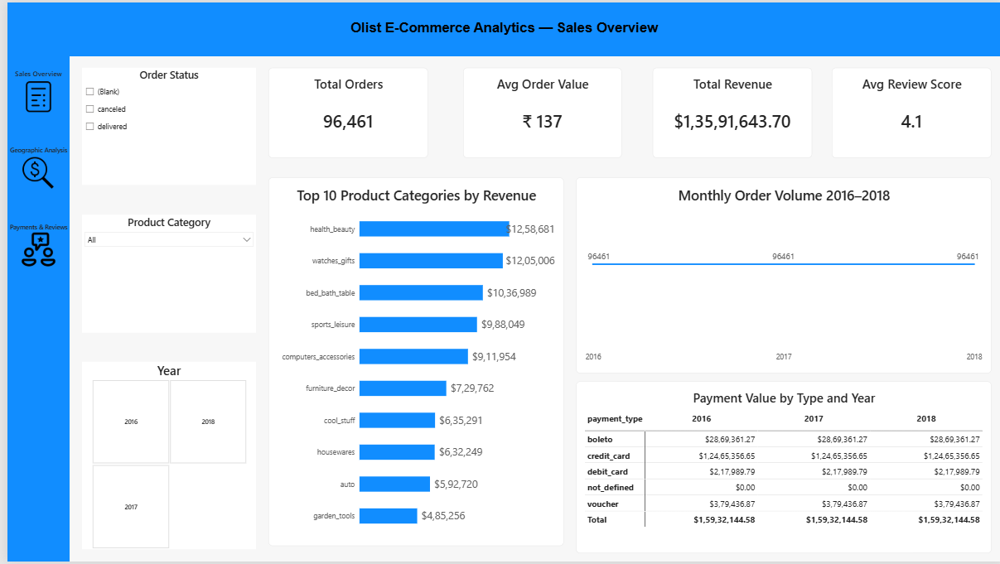
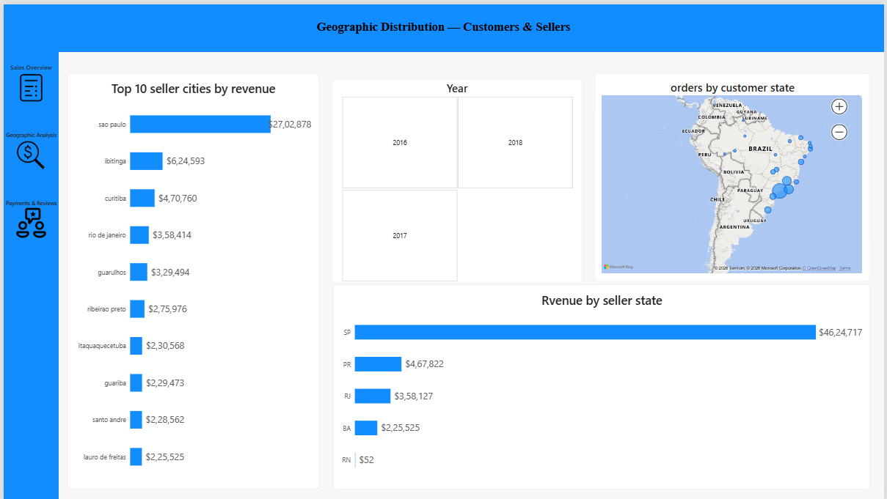
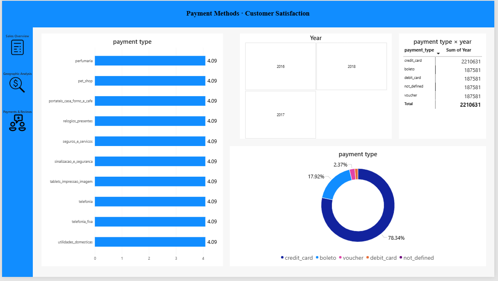

<div align="center">

# 🛒 Olist Brazilian E-Commerce Analytics Dashboard

### 📊 End-to-End Business Intelligence Solution Built with Power BI




Transforming raw e-commerce data into actionable business insights through advanced analytics, data modeling, and interactive visualizations.

</div>

---

# 📑 Table of Contents

- [Project Overview](#-project-overview)
- [Business Objectives](#-business-objectives)
- [Dashboard Screenshots](#-dashboard-screenshots)
- [Data Model](#-data-model)
- [KPIs & Metrics](#-kpis--metrics)
- [Tech Stack](#-tech-stack)
- [Dataset Information](#-dataset-information)
- [ETL Process](#-etl-process)
- [Business Insights](#-business-insights)
- [Repository Structure](#-repository-structure)
- [Author](#-author)

---

# 🎯 Project Overview

This project analyzes the **Olist Brazilian E-Commerce Dataset**, one of the most widely used datasets for Business Intelligence and Data Analytics portfolios.

The solution was developed in **Power BI** using a robust **Star Schema Data Model**, advanced **DAX measures**, and interactive dashboards that provide insights into:

✅ Sales Performance  
✅ Revenue Growth  
✅ Customer Satisfaction  
✅ Seller Performance  
✅ Geographic Distribution  
✅ Payment Behavior  
✅ Product Category Analysis  

---

# 🚀 Business Objectives

- Identify top-performing product categories.
- Analyze revenue trends and order volume.
- Understand customer purchasing behavior.
- Evaluate seller performance across Brazil.
- Measure customer satisfaction using review scores.
- Analyze payment preferences.

---

# 📸 Dashboard Screenshots

## 🏠 Sales Overview


### Key Metrics

| KPI | Value |
|------|--------|
| Total Orders | 96,461 |
| Total Revenue | $13.59M |
| Avg Review Score | 4.1 |
| Avg Order Value | ₹137 |

---

## 🌎 Geographic Analysis



### Insights

- São Paulo dominates seller revenue.
- Highest concentration of customers located in Southeastern Brazil.
- Revenue is heavily concentrated within SP state.

---

## 💳 Payments & Customer Satisfaction



### Insights

- Credit Cards represent ~78% of payments.
- Boleto contributes ~18%.
- Customer ratings remain consistently positive.

---

# 🏗️ Data Model


### Star Schema Architecture

#### Fact Tables

| Table | Purpose |
|---------|---------|
| FactOrderItems | Revenue & Order Transactions |
| FactPayments | Payment Analytics |
| FactReviews | Customer Feedback |

#### Dimension Tables

| Table | Purpose |
|---------|---------|
| DimCustomers | Customer Information |
| DimProducts | Product Attributes |
| DimSellers | Seller Details |
| DimOrders | Order Lifecycle |
| DimGeolocation | Geographic Analysis |
| DimDate | Time Intelligence |
| CategoryTranslation | Product Category Mapping |

---

# 📈 KPIs & Metrics

```DAX
Total Orders =
DISTINCTCOUNT(DimOrders[order_id])
```

```DAX
Total Revenue =
SUM(FactOrderItems[price])
```

```DAX
Average Order Value =
DIVIDE([Total Revenue],[Total Orders])
```

```DAX
Average Review Score =
AVERAGE(FactReviews[review_score])
```

---

# 🛠️ Tech Stack

| Category | Technology |
|-----------|------------|
| BI Tool | Power BI |
| Data Cleaning | Power Query |
| Data Modeling | Star Schema |
| Measures | DAX |
| Data Source | CSV Files |
| Version Control | GitHub |

---

# 📂 Dataset Information

The project integrates multiple datasets:

- Customers
- Orders
- Order Items
- Sellers
- Products
- Payments
- Reviews
- Geolocation
- Category Translation

Total records analyzed: **96,000+ Orders**

---

# 🔄 ETL Process

### Extract
- Imported raw CSV datasets.

### Transform
- Removed duplicates
- Handled missing values
- Standardized formats
- Built lookup tables

### Load
- Created optimized Power BI model.

### Analyze
- Built KPIs
- Developed dashboards
- Added slicers and drill-through functionality

---

# 💡 Business Insights

### Sales

🏆 Health & Beauty generated the highest revenue.

🏆 Watches & Gifts ranked second in revenue contribution.

### Geography

🌎 São Paulo is the strongest revenue-driving seller region.

🌎 Seller activity is concentrated in Southeast Brazil.

### Payments

💳 Credit Cards dominate customer payment preferences.

💳 Alternative payment methods have relatively low adoption.

### Customer Satisfaction

⭐ Average rating exceeds 4.0.

⭐ Most product categories maintain strong customer satisfaction.

---

# 📁 Repository Structure

```text
├── README.md
├── Olist_Ecommerce_Dashboard.pbix
│
├──screenshots
│   ├── ss_page_1
│   ├── ss_page_2
│   ├── ss_page_3
│   └── ss_page_4
│
├── datasets
│   ├── customers.csv
│   ├── order_items_dataset
│   ├── orders.csv
│   ├── order_items.csv
│   ├── payments.csv
│   ├── reviews.csv
│   ├── sellers.csv
│   └── products.csv
│   
│
└── documentation
    └── Project_Report.pdf
```

---

# 🌟 Project Highlights

✅ End-to-End BI Solution

✅ 96K+ Orders Analyzed

✅ $13.5M+ Revenue Analysis

✅ Interactive Dashboards

✅ Advanced DAX Measures

✅ Geographic Intelligence

✅ Customer Satisfaction Analytics

✅ Professional Star Schema Modeling

---

# 👨‍💻 About Me

## Meet Mehta

📊 Aspiring Data Analyst
💻 Excel • Power BI • SQL • Python
🚀 Passionate about transforming data into insights

---

<div align="center">

### ⭐ If you found this project helpful, consider starring the repository!

**Turning Data Into Decisions 📊**

</div>
